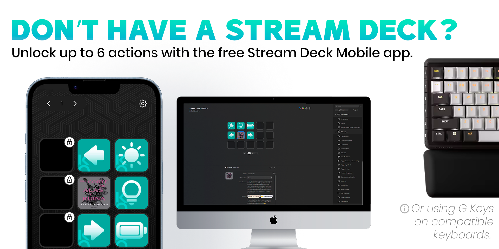

<h1 align="center">
   
  
</h1>

<h3 align="center">Control your KOReader device directly from your Stream Deck.</h3>

  <a href="#key-features">Key Features</a> •
  <a href="#actions">Actions</a> •
  <a href="#setup">Setup</a> •
  <a href="#requirements">Requirements</a> •
  <a href="#download">Download</a> •
  <a href="#support">Support</a> •
  <a href="#license">License</a>

<h1 align="center">
  
</h1>

**KOReadeck** is a Stream Deck plugin that lets you control [KOReader](https://koreader.rocks/) over your local network — no touch required. Turn pages, adjust brightness, monitor battery, preview your screen, and more, all from a single button press.

---

## Key Features

- **17 actions** — page navigation, frontlight control, bookmarks, screen orientation, battery level, and more.
- **Fully wireless** — talks to KOReader over HTTP on your local network. No wires.
- **Book cover on your deck** — pulls the cover art for whatever you're currently reading and puts it right on the button, with optional title, author, or page number underneath.
- **Live screen preview** — one press spins up a local server and opens a browser tab showing your device's screen in real time, so you can read on a bigger screen.
- Works on **macOS** and **Windows**.

---

## Actions

### Configuration

> _Set up your connection once — all other actions use it automatically._

Opens a local configuration page in your browser where you set your KOReader device's **IP address**, **port** (default: `8080`), and **request timeout**. This is the first action you should add; without it, nothing else will work.

---

### Change Page

> _Navigate your book without touching the device._

Flips pages forward or backward. Choose from:

- **Next / Prev** — single page at a time.
- **Next 10 / Prev 10** — jump 10 pages at once.
- **Custom** — define any page delta (e.g. `+5`, `-3`).

---

### Toggle Night Mode

> _Switch between light and dark reading in one press._

Toggles KOReader between light mode and night mode. The button icon updates to reflect the current state so you always know which mode is active.

---

### Toggle Frontlight

> _On/off control for devices with a built-in frontlight._

Turns the frontlight on or off. The button reflects the current state visually.

---

### Frontlight Brightness

> _Fine-tune your reading light without opening menus._

Increases or decreases frontlight intensity by one step, or a **custom delta** of your choice (range: −24 to +24). Brightness is always clamped to the safe 0–24 range.

---

### Show Bookmarks

> _Jump straight to your bookmark list._

Opens the bookmarks panel for the current book on your device.

---

### Toggle Bookmark on Current Page

> _Bookmark the current page instantly._

Adds or removes a bookmark on the page you are currently reading.

---

### Book Info

> _Your book's cover, right on your Stream Deck._

Fetches the cover art for the book currently open on your device (via **Open Library** or **Google Books** as a fallback) and displays it on the button. Below the cover you can optionally show:

- Current page number
- Title, Author, or Series
- Nothing — just the cover.

---

### Screen Preview

> _See exactly what is on your device._

Starts a local web server and opens a browser tab showing a live screenshot of your KOReader screen. Useful for checking your device without physically looking at it.

---

### Take Screenshot

> _Capture your current reading view._

Triggers a screenshot on the device and saves it directly to device storage.

---

### Open Last Document

> _Resume reading instantly._

Opens the last document you had open on your KOReader device.

---

### Battery Level

> _Keep an eye on your device's charge._

Displays the current battery percentage using a set of visual icons across 6 charge levels (empty through full), including a charging indicator. The percentage number overlay can be toggled on or off.

---

### Change Screen Orientation

> _Portrait or landscape — your choice._

Switches between portrait and landscape display mode. The button icon updates to show the current orientation.

---

### Reader Settings

> _Access reading options without touching the screen._

Opens the reader settings menu for the document currently open on your device.

---

### Status Bar

> _Toggle the KOReader footer in one press._

Shows or hides the KOReader status bar at the bottom of the screen.

---

### Exit KOReader

> _Close the app remotely._

Sends an exit command to KOReader. You will need to relaunch the app manually on the device afterward.

---

### Restart KOReader

> _Restart the app without touching your device._

Restarts KOReader remotely — useful after installing plugins or recovering from an unresponsive state.

---

## Requirements

- **Stream Deck** 6.9 or later
- **KOReader** with the HTTP server plugin enabled
- **macOS** 12+ or **Windows** 10+

---

## Download

Get the latest release from the [Stream Deck Marketplace](https://marketplace.elgato.com) or the [GitHub Releases page](https://github.com/unaigonzalezz/koreadeck/releases).

---

## Setup

1. **Install the plugin** from the Stream Deck Marketplace or from the [Releases page](https://github.com/unaigonzalezz/koreadeck/releases).
2. **Add the Configuration action** to your Stream Deck and press it — a browser page will open.
3. **Follow the steps on screen to enable HTTP Inspector** and save.
4. **You can now delete the config action**, add it again to change current settings.
5. Add any other actions. They will connect to the device automatically using the saved configuration.

> **Note:** Your PC and KOReader device must be on the same local network.

---

## Support

If you would like to support development:

If you can't donate, leaving a ⭐ on the repo goes a long way — it genuinely makes my day.

---

## Future improvements

- Custom KOReader plugin to improve interaction with Stream Deck plugin.
- Improve range of actions that work with Live Preview

Feel free to suggest new actions in the Discussions tab.

---

## No Stream Deck?

You don't need a physical Stream Deck to use this plugin. There are free and affordable alternatives:

- **[Elgato Stream Deck Mobile](https://www.elgato.com/en/stream-deck-mobile)** — the official app for iOS and Android, free for up to 6 actions.
- **Compatible keyboards** — some keyboards include built-in Stream Deck keys (e.g. Corsair Vanguard 96, Corsair Galleon...) and work natively with the Stream Deck software.

 

---

## Contributing

Pull requests are welcome. For major changes, open an issue first to discuss what you would like to improve.

---

## Thanks

- [Elgato Stream Deck SDK](https://github.com/elgatosf/streamdeck) for the Node.js plugin framework.
- [KOReader](https://koreader.rocks/) for the open-source e-reader that made this possible.
- [Open Library](https://openlibrary.org/) and [Google Books](https://books.google.com/) for cover image data.
- [Google](https://google.com) for Material Icons.

---

## License

[MIT](https://choosealicense.com/licenses/mit/)

---
